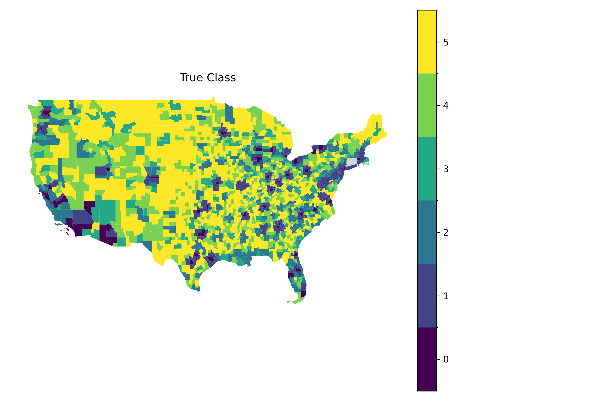
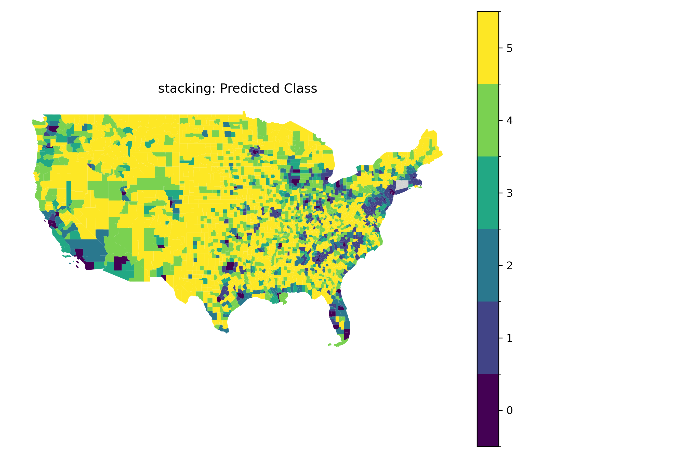
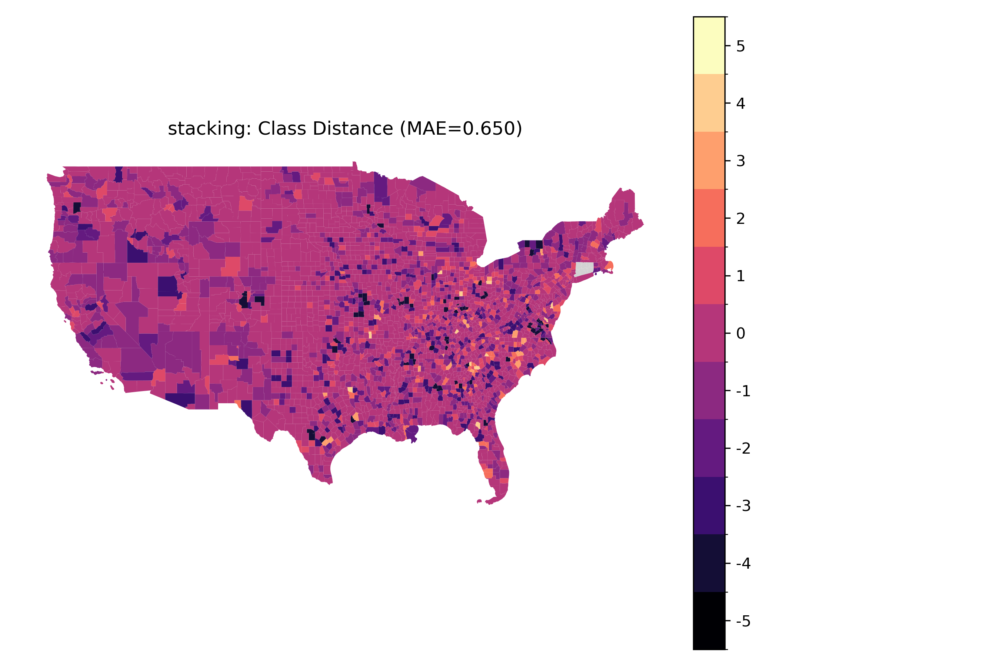
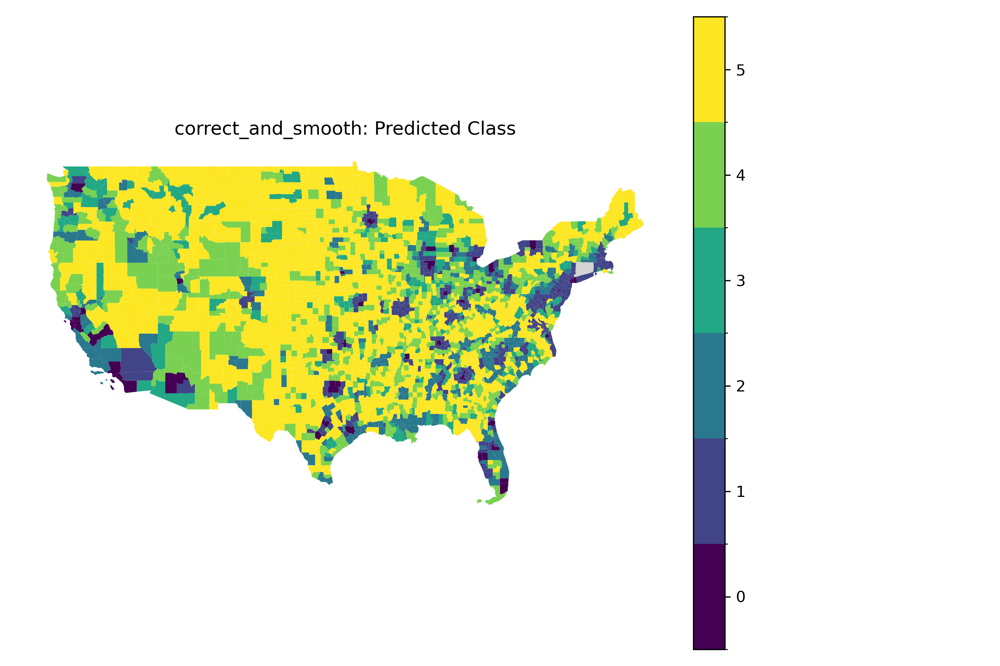
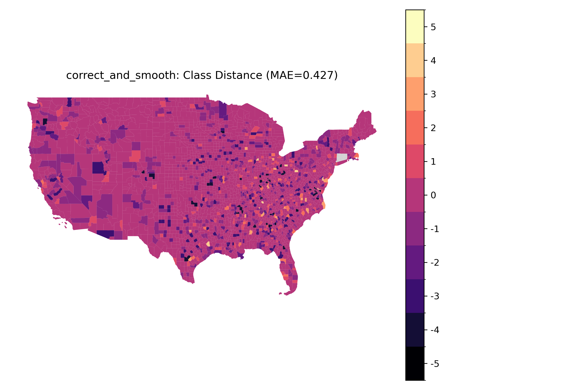

# Testbench

End‑to‑end evaluation scripts for stacking, graph metrics, and downstream tests.

## Stacking + Correct‑and‑Smooth

`testbench/stacking.py` runs:
- Expert optimization per dataset.
- Stacked classifier on OOF probabilities.
- Correct‑and‑Smooth post‑processing on graph adjacency.

Example:
```bash
python testbench/stacking.py --resume
```

### Model Architecture Results for each Stage

| Stage | Model | accuracy | f1_macro | roc_auc |
| --- | --- | --- | --- | --- |
| VIIRS | XGBoost | 0.5818 | 0.4634 | 0.8216 |
| TIGER | XGBoost | 0.5139 | 0.4126 | 0.7808 |
| NLCD | XGBoost | 0.6045 | 0.4975 | 0.8407 |
| Majority | Vote | 0.6029 | 0.5029 | 0.6980 |
| Stacking | Logistic | 0.6254 | 0.5453 | 0.8474 |
| CorrectAndSmooth | queen | 0.6516 | 0.5888 | 0.8756 |

Accompanying this table are figures showing class predictions of CONUS from each stage of the model. Majority refers to a majority vote between the predictions of each expert model for the VIIRS, TIGER, and NLCD datasets after the first stage. MAE refers to the mean absolute error of predictions. 



The majority vote by the experts:


Distance from predicted label to true label (negative implies ground truth is more rural than predicted): 


The stacking meta-learner: 





The Correct and Smooth diffusion model applied to stacked probabilities:





## Config caching:

- `testbench/model_config.yaml`

## Graph Metrics

`testbench/graph_metrics.py` evaluates adjacency diagnostics and metric learners.

## Downstream Metric

`testbench/downstream_metric.py` loads a trained metric (from YAML) and optimizes Correct‑and‑Smooth on
top of it. Furthermore, optimizes the learned metric space with the Correct-And-Smooth model's accuracy as the downstream target. 
